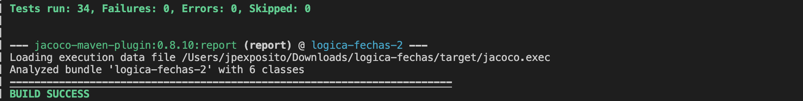
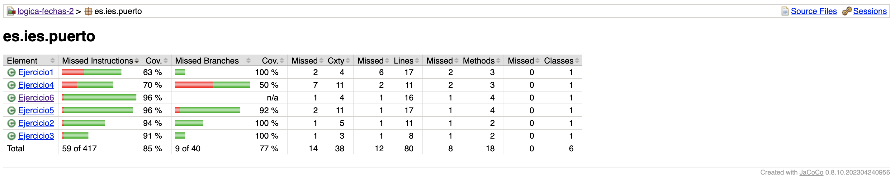

#  Lógica con Fechas (Programación)

Recuerda aplicar la lógica a cada una de las funciones que se plantean, reflexionando sobre que se se pide, y en un contexto **NO INFORMÁTICO** lo resolverias.

## Ejercicio 1: Diferencia Exacta Entre Fechas

Calcula la diferencia exacta en años, meses, días, horas, minutos y segundos entre dos fechas dadas: el 29 de febrero de 2020 a las 23:45:30 y el 1 de enero de 2025 a las 08:15:45.

---

## Ejercicio 2: Último Viernes de Cada Mes

Escribe un algoritmo para encontrar el último viernes de cada mes durante el año 2023. Devuelve una lista de las fechas.

---

## Ejercicio 3: Ajustar Horarios por Zonas Horarias

Dada la fecha y hora `2025-03-15T14:30:00` en la zona horaria de Nueva York, conviértela a las zonas horarias de Tokio, Londres y Sídney. Asegúrate de manejar correctamente los horarios de verano.

---

## Ejercicio 4: Validación de Fechas Bisiestas

Crea un algoritmo que recorra los próximos 50 años y determine cuántos días 29 de febrero habrá durante ese período. Devuelve también las fechas específicas.

---

## Ejercicio 5: Edad en Milisegundos

Calcula cuántos milisegundos ha vivido una persona nacida el 15 de julio de 1990 a las 03:30:00 (hora local). Devuelve también cuántos milisegundos ha vivido en años bisiestos.

---

## Ejercicio 6: Próximo Eclipse Solar

Dada una lista de eclipses solares históricos y futuros con sus fechas y horarios en UTC, encuentra el próximo eclipse solar que ocurrirá después del 1 de enero de 2025. Calcula también cuánto tiempo falta exactamente para ese eclipse en años, meses, días, horas, minutos y segundos.

## Salida esperada

## Programación defensiva

Realiza un diseño de [programación defensiva](https://es.wikipedia.org/wiki/Programaci%C3%B3n_defensiva).

Con ella lograrás un comportamiento adecuado ante parámetros de entrada no esperados.

## Ejemplos

- [LocalDate](https://www.w3schools.com/java/java_date.asp).

## Dudas

- Puede ser posible y recomendable hacer `uso de funciones entre ejercicios`. 
- `Durarion, Period, etc` de la clase 'java.time' serán necesario.
- ___Si tienes alguna duda más guíate por los test unitarios. Serán tu mejor aliado___.

