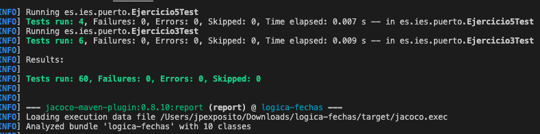
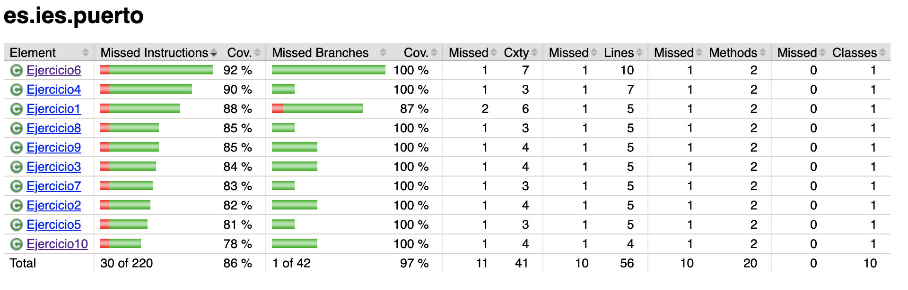

#  Lógica con Fechas (Programación)

Recuerda aplicar la lógica a cada una de las funciones que se plantean, reflexionando sobre que se se pide, y en un contexto **NO INFORMÁTICO** lo resolverias.

## Ejercicio 1: Verificar si una fecha es un viernes 13

Dada una fecha en formato `Date`, escribe un programa que determine si la fecha corresponde a un "viernes 13" (es decir, que sea un viernes y el día del mes sea 13).

**Entrada**: `2025-02-13`  
**Salida esperada**: `Sí, es viernes 13`

---

## Ejercicio 2: Calcular el número de días de un mes específico

Escribe un programa que, dada una fecha, calcule el número de días que tiene el mes correspondiente a esa fecha.

**Entrada**: `2025-02-01`  
**Salida esperada**: `28` (para el anio no bisiesto)

---

## Ejercicio 3: Calcular la fecha del último viernes de un mes

Dada una fecha, escribe un programa que calcule la fecha del último viernes del mismo mes y anio.

**Entrada**: `2025-02-15`  
**Salida esperada**: `2025-02-28` (si el mes tiene 28 días)

---

## Ejercicio 4: Determinar si una fecha es un "Día Festivo Nacional"

Dada una fecha, determina si es uno de los días festivos nacionales (por ejemplo, Navidad o anio Nuevo). Esto puede requerir una lista de fechas fijas para los días festivos.

**Entrada**: `2025-12-25`  
**Salida esperada**: `Es Navidad`

---

## Ejercicio 5: Encontrar el día de la semana de la fecha más lejana en el futuro

Dado un número `n`, calcula cuál será el día de la semana que ocurrirá después de sumar `n` días a la fecha actual.

**Entrada**:  
Fecha: `2025-01-01`  
Días a sumar: `100`  
**Salida esperada**: `Domingo` (por ejemplo, si sumamos 100 días a `2025-01-01`)

---

## Ejercicio 6: Calcular la cantidad de fines de semana (sábados y domingos) en un mes

Dada una fecha, escribe un programa que calcule la cantidad de fines de semana (sábado y domingo) que ocurren en ese mes.

**Entrada**: `2025-02-01`  
**Salida esperada**: `8` (si el mes tiene 4 fines de semana completos)

---

## Ejercicio 7: Calcular la fecha exacta para el Día de la Madre (en el país correspondiente)

El Día de la Madre en muchos países se celebra el segundo domingo de mayo. Escribe un programa que calcule la fecha de este día para cualquier anio.

**Entrada**: `2025`  
**Salida esperada**: `2025-05-11`

---

## Ejercicio 8: Calcular cuántos días han pasado desde el inicio del anio hasta una fecha dada

Dada una fecha, escribe un programa que calcule cuántos días han transcurrido desde el 1 de enero de ese mismo anio hasta la fecha proporcionada.

**Entrada**: `2025-03-15`  
**Salida esperada**: `74 días`

---

## Ejercicio 9: Determinar si una fecha es el último día del anio

Dada una fecha, escribe un programa que determine si la fecha corresponde al último día del anio (31 de diciembre).

**Entrada**: `2025-12-31`  
**Salida esperada**: `Sí, es el último día del anio`

---

## Ejercicio 10: Calcular la fecha de "San Valentín" del próximo anio

Escribe un programa que calcule la fecha de "San Valentín" (14 de febrero) del próximo anio, dado un anio actual.

**Entrada**: `2025`  
**Salida esperada**: `2026-02-14`

## Salida esperada

## Programación defensiva

Realiza un diseño de [programación defensiva](https://es.wikipedia.org/wiki/Programaci%C3%B3n_defensiva).

Con ella lograrás un comportamiento adecuado ante parámetros de entrada no esperados.

## Ejemplos

- [LocalDate](https://www.w3schools.com/java/java_date.asp).